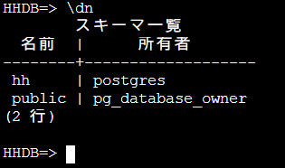
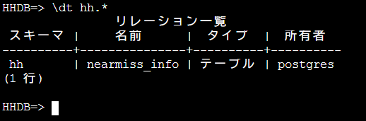

# データベース構築手順
## データベース構築
1. "HHDB"データベースを作成する。

~~~
    CREATE DATABASE "HHDB";
~~~ 
2. データベースの権限を付与する。

~~~
    GRANT ALL PRIVILEGES ON DATABASE "HHDB" TO postgres;
~~~ 

3. スキーマを作成する。

~~~
    GRANT ALL PRIVILEGES ON DATABASE "HHDB" TO postgres;
~~~ 

4. テーブルをインサートする。

~~~
    CREATE TABLE "hh"."nearmiss_info" ("id" uuid NOT NULL, "uri" character varying(4096) NOT NULL, "name" character varying(4096), "category" character varying(4096), "summary" character varying(4096), "timestamp" TIMESTAMP WITH TIME ZONE, "coordinates" xml, "attributes" xml, "files" xml NOT NULL, "is_display_enable" boolean NOT NULL DEFAULT true, "is_registered" boolean NOT NULL DEFAULT false, "upload_timestamp" TIMESTAMP WITH TIME ZONE NOT NULL, CONSTRAINT "nearmiss_info_uri" UNIQUE ("uri"), CONSTRAINT "nearmiss_info_pkey" PRIMARY KEY ("id"));
    COMMENT ON COLUMN "hh"."nearmiss_info"."id" IS 'データID';
    COMMENT ON COLUMN "hh"."nearmiss_info"."uri" IS 'uri';
    COMMENT ON COLUMN "hh"."nearmiss_info"."name" IS '名称';
    COMMENT ON COLUMN "hh"."nearmiss_info"."category" IS '分類';
    COMMENT ON COLUMN "hh"."nearmiss_info"."summary" IS '要約';
    COMMENT ON COLUMN "hh"."nearmiss_info"."timestamp" IS '発生日時';
    COMMENT ON COLUMN "hh"."nearmiss_info"."coordinates" IS '発生地点';
    COMMENT ON COLUMN "hh"."nearmiss_info"."attributes" IS '属性リスト';
    COMMENT ON COLUMN "hh"."nearmiss_info"."files" IS 'ファイル情報';
    COMMENT ON COLUMN "hh"."nearmiss_info"."is_display_enable" IS '表示可不可情報';
    COMMENT ON COLUMN "hh"."nearmiss_info"."is_registered" IS '登録有無情報';
    COMMENT ON COLUMN "hh"."nearmiss_info"."upload_timestamp" IS 'アップロード日時';
    COMMENT ON TABLE "hh"."nearmiss_info" IS 'ニアミス情報';
~~~ 

## データベース構築確認
1. 下記コマンドを実行し、RDSへ接続する。

~~~
    psql -h <RDSプロキシ名> -p 5432 -U postgres -d "HHDB"
~~~ 
2. 下記コマンドを実行し、スキーマが存在することを確認する。

~~~
    \dn
~~~ 

  

3. 下記コマンドを実行し、publicスキーマ以外にテーブルが存在することを確認する。

~~~
    \dt hh.*
~~~ 

  

